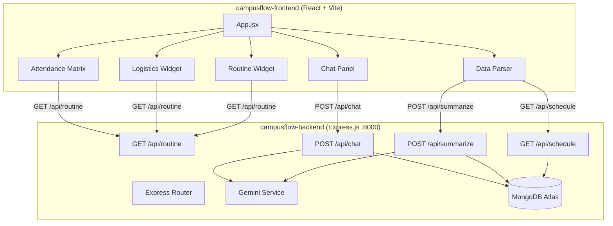
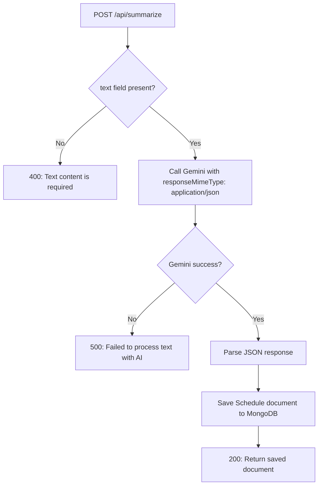

# Technical Design: CampusFlow AI OS

## Overview

CampusFlow AI OS is a full-stack campus dashboard comprising a React (Vite) frontend and a Node.js/Express backend. The frontend presents a dark-mode "AI OS" aesthetic with widget-based layout. The backend serves mock data, persists parsed schedules in MongoDB Atlas, and proxies AI requests through the Google Gemini SDK. The system is split into two independent directories: `campusflow-frontend` and `campusflow-backend`.

## Architecture



### Layer Responsibilities

| Layer | Technology | Responsibility |
|-------|-----------|----------------|
| Frontend | React (Vite), Tailwind CSS v3, Lucide React | UI rendering, user interaction, API consumption |
| Backend API | Node.js, Express.js (port 8000) | REST endpoints, request validation, CORS |
| AI Service | Google Gemini SDK (`@google/generative-ai`), gemini-1.5-flash | Text extraction, conversational AI |
| Database | MongoDB Atlas, Mongoose | Persist schedules, chat messages |

## Components and Interfaces

### Frontend Component Hierarchy

```
App
├── Header (logo, title "CampusFlow AI OS")
├── DashboardGrid
│   ├── RoutineWidget
│   │   ├── CurrentSlot
│   │   └── UpcomingSlots
│   ├── LogisticsWidget
│   │   ├── MessMenu
│   │   └── ShuttleCountdown
│   ├── AttendanceMatrix
│   │   └── SubjectRow (repeated)
│   └── DataParser
│       ├── TextInput
│       ├── ParseButton
│       └── TimelineCards
│           └── EventCard (repeated)
└── ChatPanel (floating, slide-out)
    ├── ChatToggleButton (FAB)
    ├── MessageList
    │   └── MessageBubble (repeated)
    └── ChatInput
```

### Frontend Component Specifications

| Component | Props / State | Behavior |
|-----------|--------------|----------|
| `App` | state: `routineData`, `isLoading` | Fetches `/api/routine` on mount, distributes data to widgets |
| `RoutineWidget` | props: `routine[]` | Renders current + upcoming class slots |
| `LogisticsWidget` | props: `mess`, `shuttles` | Renders meal tabs, countdown timers |
| `AttendanceMatrix` | props: `attendance[]` | Renders subject rows with percentage bars and Safe/At Risk tags |
| `DataParser` | state: `inputText`, `timeline[]`, `error` | Textarea, submit handler calls POST `/api/summarize`, fetches GET `/api/schedule` |
| `ChatPanel` | state: `isOpen`, `messages[]`, `inputMsg` | FAB toggle, message list, sends POST `/api/chat` |

### Backend Module Structure

| Module | Responsibility |
|--------|---------------|
| `server.js` | Entry point: Express app setup, middleware, MongoDB connection, route mounting |
| `routes/routine.js` | GET `/api/routine` — returns hardcoded mock data |
| `routes/schedule.js` | GET `/api/schedule` — queries Schedule collection |
| `routes/summarize.js` | POST `/api/summarize` — Gemini extraction + save |
| `routes/chat.js` | POST `/api/chat` — Gemini conversation + save |
| `models/Schedule.js` | Mongoose schema for Schedule_Model |
| `models/Message.js` | Mongoose schema for Message_Model |
| `services/gemini.js` | Gemini SDK initialization and helper functions |
| `data/mockData.js` | Mock data constants for the routine endpoint |

## API Contract Definitions

### GET /api/routine

**Response 200:**
```json
{
  "routine": [
    { "subject": "Machine Learning", "time": "09:00 - 10:00", "location": "Room 301, Block A" }
  ],
  "attendance": [
    { "subject": "Machine Learning", "percentage": 82 }
  ],
  "mess": {
    "breakfast": ["Poha", "Tea", "Banana"],
    "lunch": ["Rice", "Dal Fry", "Paneer Butter Masala", "Roti", "Salad"],
    "snacks": ["Samosa", "Coffee"],
    "dinner": ["Chapati", "Chole", "Rice", "Kheer"]
  },
  "shuttles": [
    { "route": "Campus → Railway Station", "nextDeparture": "14:30", "frequency": "Every 2 hours" },
    { "route": "Campus → City Bus Stand", "nextDeparture": "15:00", "frequency": "Every 1.5 hours" }
  ]
}
```

### GET /api/schedule

**Response 200:**
```json
[
  {
    "_id": "...",
    "category": "PLACEMENT",
    "title": "TCS NQT Registration Deadline",
    "summary": "Last date to register for TCS NQT is March 15.",
    "date": "2025-03-10T00:00:00.000Z"
  }
]
```

### POST /api/summarize

**Request Body:**
```json
{
  "text": "Hey guys TCS NQT registration last date is March 15..."
}
```

**Response 200:**
```json
{
  "_id": "...",
  "category": "PLACEMENT",
  "title": "TCS NQT Registration Deadline",
  "summary": "Last date to register for TCS NQT is March 15.",
  "date": "2025-03-10T00:00:00.000Z"
}
```

**Response 400:**
```json
{ "error": "Text content is required" }
```

**Response 500:**
```json
{ "error": "Failed to process text with AI" }
```

### POST /api/chat

**Request Body:**
```json
{
  "message": "What's my attendance like in ML?"
}
```

**Response 200:**
```json
{
  "response": "Your attendance in Machine Learning is 82%, which is above the 75% safe threshold. You're doing well!"
}
```

**Response 400:**
```json
{ "error": "Message content is required" }
```

**Response 500:**
```json
{ "error": "Failed to generate AI response" }
```

## Data Models

### Schedule_Model (MongoDB)

```javascript
const scheduleSchema = new mongoose.Schema({
  category: {
    type: String,
    enum: ['PLACEMENT', 'ASSIGNMENT', 'CLUB', 'UPDATE'],
    required: true
  },
  title: {
    type: String,
    required: true
  },
  summary: {
    type: String,
    required: true
  },
  date: {
    type: Date,
    default: Date.now
  }
});
```

### Message_Model (MongoDB)

```javascript
const messageSchema = new mongoose.Schema({
  role: {
    type: String,
    enum: ['user', 'assistant'],
    required: true
  },
  content: {
    type: String,
    required: true
  }
}, { timestamps: true });
```

## File/Folder Structure

```
campusflow/
├── campusflow-frontend/
│   ├── public/
│   ├── src/
│   │   ├── components/
│   │   │   ├── Header.jsx
│   │   │   ├── DashboardGrid.jsx
│   │   │   ├── RoutineWidget.jsx
│   │   │   ├── LogisticsWidget.jsx
│   │   │   ├── AttendanceMatrix.jsx
│   │   │   ├── DataParser.jsx
│   │   │   └── ChatPanel.jsx
│   │   ├── App.jsx
│   │   ├── App.css
│   │   ├── main.jsx
│   │   └── index.css
│   ├── index.html
│   ├── package.json
│   ├── vite.config.js
│   ├── tailwind.config.js
│   └── postcss.config.js
│
├── campusflow-backend/
│   ├── models/
│   │   ├── Schedule.js
│   │   └── Message.js
│   ├── routes/
│   │   ├── routine.js
│   │   ├── schedule.js
│   │   ├── summarize.js
│   │   └── chat.js
│   ├── services/
│   │   └── gemini.js
│   ├── data/
│   │   └── mockData.js
│   ├── server.js
│   ├── package.json
│   └── .env
│
└── .kiro/
    └── specs/
        └── campusflow-ai-os/
            ├── requirements.md
            ├── design.md
            └── tasks.md
```

## Error Handling

| Scenario | Layer | Handling |
|----------|-------|----------|
| Empty/missing text in POST /api/summarize | Backend | Return 400 with `{ error: "Text content is required" }` |
| Empty/missing message in POST /api/chat | Backend | Return 400 with `{ error: "Message content is required" }` |
| Gemini SDK failure (network/quota) | Backend | Catch error, return 500 with descriptive message |
| MongoDB connection failure | Backend | Log error, server fails to start with clear message |
| API fetch failure from frontend | Frontend | Display user-friendly error message in the respective widget |
| Gemini returns non-JSON (summarize) | Backend | `responseMimeType: 'application/json'` prevents this; fallback: 500 error |

### Error Flow (Summarize Endpoint)



## Testing Strategy

Since this project is primarily a full-stack web application with UI rendering, external AI service calls, and database CRUD operations, **property-based testing is not applicable**. The codebase consists of:
- React components rendering UI (best tested with component/snapshot tests)
- Thin Express route handlers wrapping MongoDB queries and Gemini API calls (best tested with integration tests using mocked services)
- No pure transformation functions with wide, meaningful input spaces

### Recommended Testing Approach

| Test Type | Scope | Tools |
|-----------|-------|-------|
| Unit Tests | Backend route handlers, input validation | Jest, supertest (mock Gemini + MongoDB) |
| Component Tests | Frontend components render correctly with props | Vitest + React Testing Library |
| Integration Tests | Full API request/response cycles | supertest with in-memory MongoDB |
| Manual/E2E | Full dashboard loads, chat works, parser works | Browser manual testing (hackathon scope) |

### Key Test Scenarios (Example-Based)

1. **POST /api/summarize** — empty text returns 400
2. **POST /api/summarize** — valid text returns saved schedule document with correct fields
3. **POST /api/chat** — empty message returns 400
4. **POST /api/chat** — valid message returns AI response
5. **GET /api/routine** — returns expected mock data structure
6. **GET /api/schedule** — returns array sorted by date descending
7. **AttendanceMatrix** — renders "Safe" tag for 75%+ and "At Risk" for below 75%

Given the hackathon context, manual testing and a few focused integration tests provide the best value-to-effort ratio.
